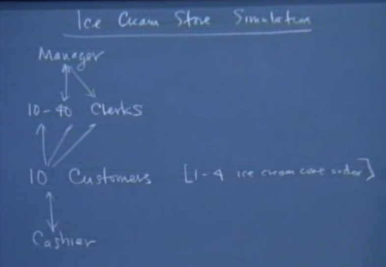

## Ice Cream Store Simulation




We’re going to have **ten customers**. There’s going to be a customer function. We’re gonna spawn off ten of those things and we’re gonna actually know how many ice cream cones each of the customers order. It’s gonna be between 1 and 4.

There’s gonna be **a cashier** that each of the ten customers approaches as they’re ready to pay. So there’s a little bit of contention and I think there’s already clearly a flavor of
currency and race condition going on because these ten customers have to approach this cashier and the best metaphor I can think of is when your mom, when you were going
with her a little kid to the market she’d have to go to the deli and she’d have to potentially edge out and get atomic access to that little number thing. She pulled 33 or the 94 or whatever it was, and you always looked at the number and it
was like 22 away and you go, “Oh, my God, we’re gonna be here forever.” Okay? But there certainly is gonna be thread-to-thread communication between all the customers,
okay, and this one cashier. 

There’s gonna be **a single manager thread**. What he does is **he approves or disapproves of ice cream cones**. He doesn’t make them himself, he just approves and disapproves of them with a – like a coin flip is what really happens.
They’re gonna be **between 10 and 40 clerks**. The reason it’s **10 and 40** is because every single customer is going to give birth to a clerk thread – one clerk for every single ice
cream cone that needs to be made. So the people who are ordering, they’re really impatient. They want – they have four **ice cream cones to be made in parallel**.

So the customer never sees the manager but these ten customers interact with 10 to 40 clerks, order the ice cream cones, they accept the money, make the ice cream cones, but all the clerks interact with the manager. They have to acquire a lock on the manager’s time, because the manager is overwhelmed if more than two people are in his office at any one moment.
So he can only accept one person in the office with one ice cream cone so there’s no confusion as to which ice cream cone he’s approving or disapproving of. 


So we’re gonna run a simulation where there are up to 52 threads running simultaneously and there’s certainly gonna be 4 different types of threads. 
- I want the manager to basically arrive at the store and not to leave the store until he’s approved the number of ice cream cones that he needs to approve. 
- I want each thread – the clerk, to only – to live as long as is necessary to make a good ice cream cone and hand it over to the customer. 
- I want the customers to be able to order their ice cream cone, get it, go and pay for it, and leave the store. 
- I want the cashier to know that he’s rung up ten different customers. 

<br>
<br>

So you want to start thinking about what are the constructs that you will need in order to maintain synchronizations issues between all of those players in the game. 

- clerk and customer:
The thing is the customer comes in and he wants one to four ice cream cones and he will fire clerks. After he gets all his cones he will go to the cashier, right? But he cannot go to the cashier until all the clerks give him back his ice cream cones. So you can start to see, like, this kind of 1 to N communication that we talked about, right. You can see that this guy is gonna request N clerks and he has to wait for the N
clerks to get the job done before he can go to the cashier, right.

- clerk and manager:
And so only one clerk can access the manager’s office. At the same time the manager will be waiting all the time because he has to wait for all the ice cream clerks to be done for all the customers before he can go home. So the manager will be in kind of a loop just waiting to be requested for an inspection.
And once he finishes the inspections he gets back the result to the clerk and he keeps waiting again until all the potentially 40 cones are done and inspected. So the clerk will basically have to request from the manager who’s waiting. So there’s the manager waiting for the clerk to request. There is also the clerk waiting for the manager to finish his inspection. So we have this kind of **binary rendezvous** again. 

- customer and cashier:
So the customers are waiting for their cones. And after they get their cones they just go to the cashier in a line and this line has to be maintained on a FIFO order. And we have to also think about that. How are we gonna insure that the customer
that arrives first at the cashier gets really served first and leaves first. You will see, again, the kind of binary rendezvous thing between each customer and the cashier because the cashier has to be waiting all the time for a customer to request the service or basically a customer to show up in line. And after a customer shows up in line he will be waiting for a cashier to finish handling his billing and let him go basically.

### `main()`

```C
int main() {
    int totalCones = 0;
    initThreadPackage(false);
    setupSemaphores();
    for (int i = 0; i < 10; i++) {
        int numCones = RandomInterger(1, 4);

        /// Customer function with thread
        ThreadNew(---, Customer, 1, numCones);

        totalCones += numCones;
    }
    ThreadNew(---, Cashier, 0 /* no parameter*/);

    ThreadNew(---, Manager, 1, totalCones);
    RunAllThreads();
    freeSemaphores();
    return 0;
}
```

`setupSemaphores();`: Remember this is a construct
that is appointed to something that is allowed in the `heap`. So you have to always remember to free your semaphores `freeSemaphores();`.

### `Manager()`

```C
struct inspection {
    bool passed = false;
    Semaphore requested = 0;
    Semaphore finished = 0;
    Semaphore lock = 1;

}
```

- `requested`: The manager has to keep waiting until it’s requested for inspection. And also the clerk has to wait until it knows that the manager finished its inspection. So we need some kind of semaphore for rendezvous the semaphor  `requested`. And so this is gonna be signaled by the clerk to the manager that it requests an inspection. 

- `finished`: We have the semaphore finished and we
also understand that once the manager – once the clerk requests inspection it will wait on this finished semaphore which means it’s gonna block until the manager finishes the
inspection and then signal the semaphore and then it wakes up.

－　`inspection`: 全局变量　全局资源

```C
void Manager(int totalCones) {
    int numApproved  = 0;
    int numInspected = 0;
    while (numApproved < totalCones) {
        semaphoreWait(inspection.requested);   /// Wait until Clark request or A request less (like Reader)
        numInspected++;
        inspection.passed = RandomChance(0, 1);  /// random number between 0 and 1
        if (inspection.passed) {
            numApproved++;
        }
        semaphoreSignal(insepction.finished);  /// Add a new insepection (Like Writer)
    }
}
```

### `Clerk()`

What the clerk needs to do. It needs to make one cone and have the manager inspect it. It needs to repeat this cone until it passes. And once it passes it just hands the cone to the customer. 

```C
void Clark(Semaphore clerksDone) {
    bool passed = false;
    while (!passed) {
        MakeCone();
        semaphoreWait(inspection.lock);  /// Acquire this office

        semaphoreSignal(insepction.requested);  /// a more request (like Writer)

        semaphoreWait(insepction.finished);  /// Wait until Manager inspection finish (like Reader)
        passend = insepection.passed;  /// Get the checked value from this insepection

        semaphoreSignal(inspection.lock);  /// Unlock (Leave) this office
    }
    semaphoreSignal(clerksDone);  /// this clark done
}
```

- `Semaphore lock = 1; in struct inspection`: So we need the binary lock. We basically need to lock the manager’s office, so that we can insure at any point in time only one clerk can get in this office. So you want one clerk at least to get in. And you want only one clerk to get in. You cannot have it zero. Zero will be a deadlock, because nobody’s gonna ever be able to get in. You cannot have it two because two means two clerks can potentially be in at the same time.

<br>

```C
       passend = insepection.passed;
       semaphoreSignal(inspection.lock); 
```

- If those two lines kind of flipped, what would happen: probably you could have the inspection dot lock signaled, which means that the lock of the officer of the manager is
no longer locked and any other clerk could get in. Some other clerk could get into the managers office, show him his cone, get his passed value of right original pass value before the first guy gets back the processor. 
`inspection`作为一个全局变量　会被其他线程所更改

<br>

### `Customer()`

```C
void Customer(int numCones /*1 2 3 4*/) {
    Browse();
    Semaphore clerksDone = 0;
    for (int i = 0; i < numCones; i++) {
        ThreadNew(---, Clerk, 1, clerksDone);
    }

    /// Blocked, until numCones all signaled
    for (int i = 0; i < numCones; i++) {
        semaphoreWait(clerksDone);  /// like DownloadHelper in lec17.md
    }
    semaphoreFree();
    WalkToCashier();

    semaphoreWait(line.lock);
    int place = line.number++;
    semaphoreSignal(line.lock);

    semaphoreSignal(line.requeted);
    semaphoreWait(line.customers[place]);
}
```

<br>

### `Cashier()`

```C
struct line {
    int number = 0;
    Semaphore requested = 0;
    Semaphore customers[10];
    Semaphore lock = 1; /// lock the resource: int number 
}
```

- `requested`: Now the cashier is gonna be waiting until somebody shows up in line. And when somebody shows up in line this means that a cashier is requested. So we have a semaphore that the cashier is gonna wait on saying, “I’m waiting until I’m requested.” Until somebody basically shows in line. So we have a semaphore `requested` and this is going to be initialized to zero.

- `customers[10]`: We also have another semaphore; this is a little tricky, now each customer with the cashier they have some kind of synchronization going on. Every customer has to
go and say, “Okay, signal me when you are done with my bill. And it has to be me because I am waiting in the queue in this specific position.” So there should be some – it’s not really that we are the customers and we are waiting for you, cashier, to signal somebody of us. It’s not really somebody, it’s not any one of us and somebody will leave. We’re not caring about all the customers leaving in the end; we are really caring about every single one of them leaving in his turn.And this should give you an idea about having this kind of struct that would have a semaphore that is **a rendezvous semaphore between every single customer and the cashier** but this semaphore has to **be for every single customer** because it has to maintain the order of every single customer.

- `customers[10]`: So in here we will have a semaphore, let’s call it customers, and those are the customers that basically requested the cashier’s service but are waiting to be serviced. **So this is gonna be an array of ten semaphores**, one for every single customer in turn. So you come, you pick a number, you know you’re number three, then you are gonna wait
on the semaphore of three. And the cashier, once he gets to your turn he’s gonna signal customer of three so that’s you – it’s your turn to leave. 
- `customers[10]`: How can you insure that the customer –
the first one in the line is the one that came in order? Because basically remember that you are not keeping track of the state. There are customers that finish and they get all
their cones and they go to the cashier. You don’t remember who came first. You don’t remember the order. You don’t remember which one picked the number. If you say the one in the beginning of the line that’s what we’re doing basically, we’re keeping track of who is at the beginning of the line.
We’re gonna say if it’s the one in place number zero and move on to one which is basically the beginning of the line. If you say that they shift. But if you don’t do that then you don’t know because you have like threads that finished at random times and you have no clue whatsoever which finished first. 

- `Semaphore lock = 1;`: We need a lock for the number. Basically you can think about this. Two guys go, they check what is the number. The number is zero. The other one also – and the first one gets out of the processor. The other one gets the – gets to be scheduled, checks the number, it’s still zero and they both increment the number; they both get the number one. So this is why, again, we need the lock on this number to make sure that this is the shared resource, this is where we have race conditions and this is what we want to secure. So let me have a semaphore `lock` and it’s gonna be initialized to one.


<br>

```C
void Cashier() {
    for (int i = 0; i < 10; i++) {
        semaphoreWait(line.requested);
        Checkout(i);
        semaphoreSignal(line.customers[i]);
    }
}
```