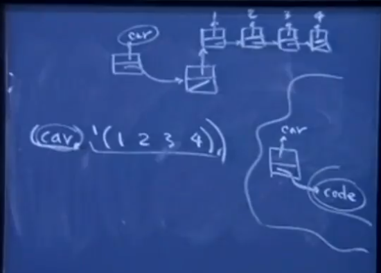

### `flatten`
```Scheme
> (flatten '(1 2 3 4))
(1 2 3 4)

> (flatten '(1 (2 "3") "4" ((5))))
(1 2 "3" "4" 5)

> (define flatten (sequence)
    (cond ((null? sequence) '()
            ((list? (car sequence) (appende (flatten (car sequence) (flatten (cdr sequence)))))
            (else (cons (car sequence) (cdr sequence)))))))

```

### `sorted`


```Scheme
> (sorted? '(1 2 2 4 6))
#t

> (sorted? '(1 2 20 4 6))
#f

(define sorted? (num_list)
    (or (< (length num_list) 2)
        (and (<= (car num_list) (cadr num_list)
            (sorted? (cdr num_list)))))))
```

<br>

```Scheme
> (sorted? '(1 2 2 4 6) <=)
#t

> (sorted? '("a" "b" "d" "c") string<?)
#f

(define sorted? (seq comp)
    (or (< (length seq) 2)
        (and (comp (car seq) (cadr seq))
            (sorted? (cdr seq) comp))))
```

### What happens when you invoke a function



```Scheme
(car '(1 2 3 4))
```

- `car`: It actually digests this token `car`, and `car` happens to occupy something of the leading slot in the series of slots that make up a link list. And you know, by looking at it, that that is a symbol . It’s supposed to be a test of functionality that tells you how to digest and manipulate the remaining arguments. 
 
- I just drew a symbol table of functions there.
And among the functions that are defined here, there actually is an entry where the key is the `car` and it’s associated – and I’ll just write it this way – with `code`.  That `code`　in link list form that should be invoked whenever `car` is consulted as the function that should be guiding evaluation. 

- So what happens, and it really does do this behind the scenes, it digest `'(1 2 3 4)`; it builds this as a data structure. It does any recursive evaluation of arguments that it needs to do, but it will be suppressed here because of the quote. It then goes and finds the funct – the `code` that’s associated with this and then, there’s some general meta-code元代码 thing　behind the scenes, that figures out how to manipulate the
arguments, and produce a result based on the contents of this thing 

- `code` is stored in memory much like this list `'(1 2 3 4)`. It’s just understood to be an in-memory representation of the recipe that needs to be followed, and a series of instructions as to how to manipulate the remaining arguments of the function
invocation. It really is this in-memory representation of the functionality. It’s almost like you’re reading from a file, the series of instructions that are allowed. Okay? And you store those instructions in memory and associate them with this keyword. And that there’s some way, behind the scenes, that it actually uses this to guide execution of this type of
execution statement.