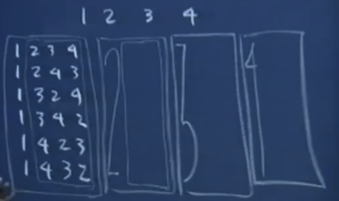

### `powerset`

```Scheme
(define (powerset set)
    (if (null? set) '(()))
        (append (powerset (cdr set)))
            (map (lambda (subset) (cons (car set) subset)) (ps (cdr set)    )))
```

It’s not a huge issue from an algorithmic standpoint. It
is functionally accurate and functionally correct. It takes an exponential amount of time anyway. It
actually makes the same recursive call twice. 

<br>

### `let` binding
There is this construct in scheme, right? It’s called a
let binding. It is actually very similar to a lambda. It’s really just syntaxtic sugar for calling an inner function. 

This first `powerset` is functionally correct. It runs very, very slowly for any set with more than, like, say six or seven elements. 

<br>
<br>
<br>

```Scheme
(define (powerset set)
    (if (null? set) '(()))
        (let ((ps_rest (ps (cdr set))))
            (append ps_rests (map (lambda (subset (cons (car set) subset)) ps_rest)))))
```


This second one is more intelligent.

`(let ((ps_rest (ps (cdr set)))) ..)`: Formally, this is everything between this `let` parentheses is supposed to be a list of pairs. I only happen to have one pair that’s necessary, but if I had several variables I wanted to initialize and use in what I’m about to write then I could just provide a list of them. But what I’m basically asking is I’m asking `scheme` to let me associate this `ps_rest`as a variable name. It’s more than just being clever and only calling this thing once. It actually saves a huge amount of time because now what can happen is I can `append` `ps_rest`. 

```Scheme
(let ((x expr1)
     (y expr2)
     (z expr3))
     ......)
```

```Scheme
(let ((x --)
     (y --))
     (a x y))
```

But let me just explain what `let` is more or less equivalent to. Do you understand that `a x y`in some ways
it’s almost like **a function call**? It’s like you’re evaluating this argument right here and associate it with a variable called `x`. You’re evaluating this and associating it with a variable called `y`. 

This is a more sophisticated clever use of `lambda`, but I can totally explain what this is more or less compiled to or translated to after it’s been read by the scheme interpreter.

<br>

```Scheme
((lambda (x y) (a x y)) --, --)
```

We put symbols after `lambda` that evaluate the `lambda`’s. They’re bound to cope, but you can put the explicit code at the front if you want to. I’m gonna put lambda of `x` and `y` that calls `a x y` as part of its implementation. And its body of that `lambda` function is more or less synonymous with the body of the `let`
statement. This `lambda` expects two arguments. 

So what the `let` thing really ends up being is just a rearrangement or a different way of expressing the application of some anonymous function to the expressions that you’re evaluating at the top. 

If you look at the let it makes it look like the evaluation of those arguments is happening first and then some code block is executed under the context of those variable assignments. That’s exactly what happens with **function evaluation**, too. You evaluate the parameters. In whatever order that they want to and scheme doesn’t dictate what order the parameters will be evaluated in. 


`--` and `--` get evaluated. You certainly do not want to have the result of the first `--` influence the evaluation of the second `--`. 

But `let` is functionally identical to `lambda` and any
limitations that I’m imposing just by rule of this right here about what order things are evaluated in can also be said about this. 

<br>
<br>
<br>

### `permute`

```Scheme
> (permute '(1 2 3))
((1 2 3) (1 3 2) (2 1 3) (2 3 1) (3 1 2) (3 2 1))
```



`(1 2 3)` ---> `((1 - perms) (2 - perms) (3 - perms))`

```Scheme
(define (permute items)
    (if (null? items) '(()))
    (apply append 
        (map (lambda (elem)
            (map (lambda (permutation)
                (cons elem permutation))
                (permute (remove items elem)))) items))
```