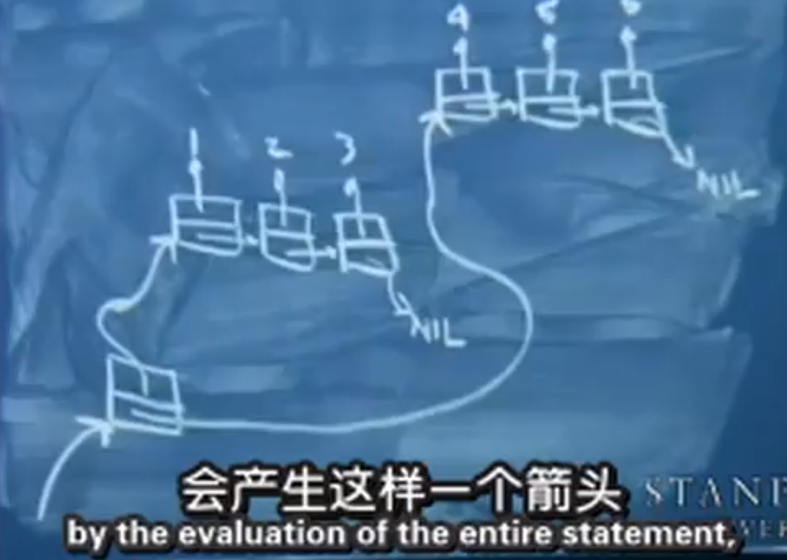
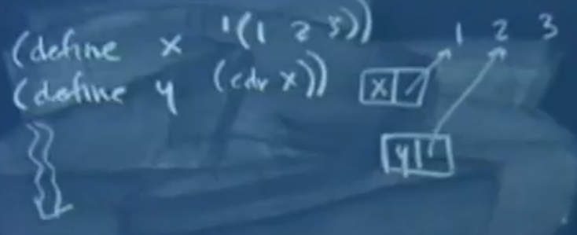
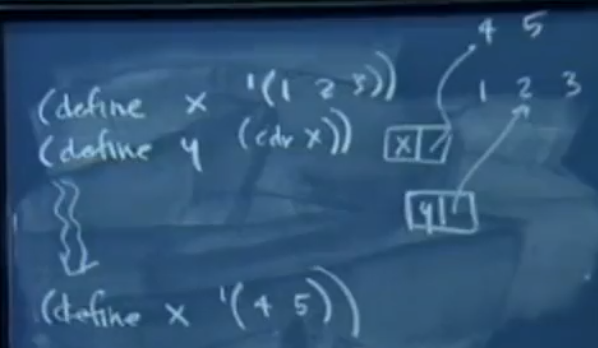
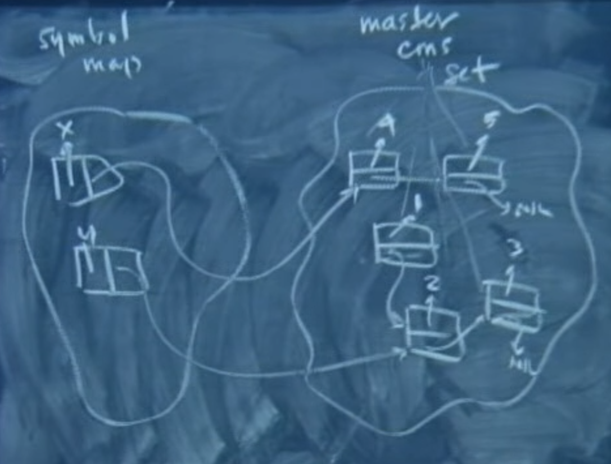

## Memory Issue in `Scheme`

### `int`


|`int`| `4`|
|-|---|

|a `pointer` pointing at `int`|
|-|

When you type in a `4` the scheme interpreter is prepared to **build a variable in memory** that stores that `4`.

What basically happens is it recognizes as it parses it that it’s a pure integer `int`. It actually returns **a `pointer` pointing at `int`**. So it returns a pointer to the data structure that is self-typed and self-identified as an integer and it levies some type of print operation against this thing **as part of the read, evaluate, print result loop (REPL)**. 

So the reason this prints out a `4` is because the thing that is returned by evaluation is expressed as this `pointer` and so it goes to this thing and says, oh, it’s a `4`, so that’s what it’s gonna print out. I’m gonna print it out according to what this data type is `int`. 


### `string`

|`hello`|
|-|

|`text`|a `pointer` pointing at `hello`|
|-|---|

|a `pointer` pointing at `text`|
|-|


When you type in `hello` it returns a pointer to something that’s tagged as `text` or a `string`. Rather the actual details are up to the interpreter, but as long as they return this to the read, develop, print loop and print knows how to deal with pointers to these types of cells that are self-type identifying it knows how to interpret the rest of this entire thing. 


<br>
<br>

### `list`


|`int`1|1|
|-|---|

|`int`2|2|
|-|---|

|`int`3 |3|
|-|---|


|a `pointer` pointing at `cons`1|
|-|

|`cons`1: a node of a `list`|`car`: a `pointer` pointing at `int`1|`cdr`: a pointer pointing at a `cons`2|
|-|---|---|

|`cons`2: a node of a `list`|`car`: a `pointer` pointing at `int`2|`cdr`: a pointer pointing at a `cons`3|
|-|---|---|

|`cons`3: a node of a `list`|`car`: a `pointer` pointing at `int`3|`cdr`: a pointer pointing at a `NIL`|
|-|---|---|

|`NIL`|
|-|

That means that the thing is returned is part of the **read, develop, print loop** has to be the address of the `leading nodule list` has to know it’s a `list`, so it knows how to print itself out.

Thing is that’s interesting is that when `Scheme` digests this `list` `'(1, 2, 3)` it knows how to programmatically – like it’s **reading a data file** where you’ve happened to express your sequence of numbers using `Scheme` like syntax and that behind the scenes every time it hits an `open paren (` it knows it’s gonna be building a `list` for you behind the scenes.

<br>

`'(1 2 3)` ==  `(cons 1 (cons 2 (cons 3 '())))`

`cons` as a `Scheme` symbol is attached with code. It’s native to the interpreter that knows how to basically `malloc` or `operator new`. 

And after it does that it has to figure out what to put in `node` and what to put in `car` and `cdr`. 

<br>

`(define seq '(1 2 3))`

Because the `define` statement is one of the few things we've learned – in fact, it's really the only thing we've learned that has a **side effect**, it would **associate in some global symbol table** this thing called `seq`, and it would **be associated and just put as an entry in some kind of global map**. So that any time you reference `seq` and they note that it's **not a local variable**, it looks **in this global map** to figure out what data is associated with it.

```Scheme
> (car seq)
1
> (cdr seq)
(2 3)
```
<br>
<br>

```Scheme
> (cons '(1 2 3) '(4 5 6))
((1 2 3) (4 5 6))
```

|`int`1|1|
|-|---|

|`int`2|2|
|-|---|

|`int`3 |3|
|-|---|


|a `pointer` pointing at `cons`1|
|-|

|`cons`1: a node of a `list`|`car`: a `pointer` pointing at `int`1|`cdr`: a pointer pointing at a `cons`2|
|-|---|---|

|`cons`2: a node of a `list`|`car`: a `pointer` pointing at `int`2|`cdr`: a pointer pointing at a `cons`3|
|-|---|---|

|`cons`3: a node of a `list`|`car`: a `pointer` pointing at `int`3|`cdr`: a pointer pointing at a `NIL`|
|-|---|---|

|`NIL`|
|-|

<br>

|`int`4|4|
|-|---|

|`int`5|5|
|-|---|

|`int`6|6|
|-|---|


|a `pointer` pointing at `cons`4|
|-|

|`cons`4: a node of a `list`|`car`: a `pointer` pointing at `int`4|`cdr`: a pointer pointing at a `cons`5|
|-|---|---|

|`cons`5: a node of a `list`|`car`: a `pointer` pointing at `int`5|`cdr`: a pointer pointing at a `cons`5|
|-|---|---|

|`cons`6: a node of a `list`|`car`: a `pointer` pointing at `int`6|`cdr`: a pointer pointing at a `NIL`|
|-|---|---|

|`NIL`|
|-|

**TO**



|`int`1|1|
|-|---|

|`int`2|2|
|-|---|

|`int`3 |3|
|-|---|

|a `pointer` pointing at `cons`|
|-|

|`cons`|`car`: a `pointer` pointing at `cons`1|`cdr`: a `pointer` pointing at `cons`4|
|-|-|-|

|`cons`1: a node of a `list`|`car`: a `pointer` pointing at `int`1|`cdr`: a pointer pointing at a `cons`2|
|-|---|---|

|`cons`2: a node of a `list`|`car`: a `pointer` pointing at `int`2|`cdr`: a pointer pointing at a `cons`3|
|-|---|---|

|`cons`3: a node of a `list`|`car`: a `pointer` pointing at `int`3|`cdr`: a pointer pointing at a `NIL`|
|-|---|---|

|`NIL`|
|-|

<br>

|`int`4|4|
|-|---|

|`int`5|5|
|-|---|

|`int`6|6|
|-|---|

|`cons`4: a node of a `list`|`car`: a `pointer` pointing at `int`4|`cdr`: a pointer pointing at a `cons`5|
|-|---|---|

|`cons`5: a node of a `list`|`car`: a `pointer` pointing at `int`5|`cdr`: a pointer pointing at a `cons`5|
|-|---|---|

|`cons`6: a node of a `list`|`car`: a `pointer` pointing at `int`6|`cdr`: a pointer pointing at a `NIL`|
|-|---|---|

|`NIL`|
|-|

The `cons` statement is actually just a request to build a new node **|`cons`|`car`: a `pointer` pointing at `cons`1|`cdr`: a `pointer` pointing at `cons`4|** to put the address of **`cons`1**, whether it's a `1` or a `list` and put the address of the second address of **`cons`4**. And so when the address of this is produced by the evaluation of the entire statement, it does have the side effect of constructing this node **|`cons`|**. 


<br>
<br>

### `...`

I actually wanna write **generic map**. That takes some function object and **either one or two or three or four lists**, depending on how many arguments the actual function object can deal with.

```Scheme
> (map car '((1 2) (3 4) (5 6 7)))
(1 3 5)
> (map + '(1 2) '(10 20) '(100 400))
(111 422)
> (map * '(1) '(2) '(3) '(4) '(5)) ## Factorial阶乘
(120)
```

<br>

```Scheme
(define (unary_map fn seq)
    (if (null? seq) ()
        (cons (fn (car seq))
            (unary_map fn (cdr seq)))))
```

<br>
<br>
<br>
<br>

But in order to accommodate a variable number of arguments容纳变化数量的参数, you have to do the equivalent of `...` but in Scheme. As an aside right here, let me just talk about what happens if you define – I'll just call it some dumb name like `bar` – and I'll give it these arguments – `a b c`.

`a b c . d`: 
- The `.` in this context just means that everything that comes after argument three `c`, like
arguments four and five and six, if there are that many, that they should all be collected
and put into this thing `d` as a list.

<br>

```Scheme
> (define (bar a b c . d)
    (list a b c d))

> (bar 1 2 3 4 5 6)
(1 2 3 (4 5 6))

> (bar 1 2 3)
(1 2 3 ())
```


`define bar`: 
- I just define `bar` to be this, to be the **listification** of `a b c d`, `list` just basically takes all of these four elements and wraps an extra bookend of parentheses around it. 

`(bar 1 2 3 4 5 6)`: 
- So if I call the `bar` function on `1 2 3 4 5 6` the output listifies these **four** elements – `1 2 3`, and `d` is then equal to the `list` that contains these three elements ` 4 5 6`. That's how **one additional argument** can accommodate everything in the `...` sense. 

`(bar 1 2 3)`:
- I should emphasize that if you do this, you're actually gonna get `(1 2 3 ())`. And if you try to pass **fewer than three arguments** to `bar`, it's gonna choke for the same reasons it would choke if there weren't a `.` there. You have to have at least as many arguments as are required (here 3).


<br>
<br>
<br>
<br>

#### `map`

So the implementation of `map` I actually think is very, very cool but it's very, very dense
and it uses apply and it uses `mapping`, it uses `unary map`, and it uses function objects and
things like that. It's a great function, and this is going to be the prototype for it.

```Scheme
(define (map fn first_list . other_lists)
    (if (null? first_list) '()
        cons (apply fn cons (car first_list) (unary_map car other_lists))))
```


# Garebge Collection

```Scheme
(define x '(1 2 3))
(define y (cdr x))
```


```Scheme
(define x '(4 5))
```



<br>
<br>

So if whatever Scheme environment you're dealing with is detecting that memory is dear
and it actually would like to clean up orphan memory for you, deallocate the memory, do
what's called **garbage collection** – that's the terminology that's used in all modern
languages.


It really should understand or have enough of a structure in place to not touch the `4`
and the `5`, and not to touch the `2` and the `3`, but to reclaim the `1` if it wanted to只需要清理掉1. So just in this picture, `2 3 4 5` are still actively – are still reachable
from some symbol. `1` is not reachable.

The system could just leave it orphaned for a while, but eventually, when maybe it's
waiting for I/O or it's waiting for a network connection or doing something where it
actually doesn’t have anything else to do, it might say okay, well, since I'm not doing
anything meaningful, I'll go and do garbage collection.


## how could it actually do **garbage collection**?

### reference counts 

Well, one technique is that some systems might actually go ahead and decorate these nodes with what are called **reference counts**. 

```Scheme
(define x '(1 2 3))
(define y (cdr x))
```

|`1`|1|
|-|-|

|`2`|2: because `y` and `1` are pointing at `2`|
|-|-|

|`3`|1|
|-|-|

<br>
<br>

```Scheme
(define x '(4 5))
```

|`1`|0: have to be a garbage, to be collected|
|-|-|

|`2`|2: because `y` and `1` are pointing at `2`|
|-|-|

|`3`|1|
|-|-|

|`4`|1|
|-|-|

|`5`|1|
|-|-|

<br>
<br>

The problem with **reference counting** is that the real version of `Scheme` actually
allows you to update the current fields of `cons` cells in place. So you actually can program with **side effect**, and that basically means that if you want to you can create a circularly linked list.

And that would mean everything in that list would have a mutual reference count of **at least one*, even though it might be this orphaned ring of friends即使他的无用的内存. 


So **reference counting** doesn’t actually work, it not to be able to reclaim
**everything**. 

So what happens is that this is very high level, but I think conceptually. Every single time you call `cons` either **directly** or it's called on your behalf because you’ve just **typed in a list constant列表常量** or you even use a `define` a factorial as a
function – it actually stores the code in list form.

But you can imagine there being something of a **master `cons` set**, okay, where every single
con cell that has been created but yet to be deallocated is just catalogued somehow
behind the scenes.



Now how would this as a system know that this `cons` cell `1` in the right can be reclaimed? The fact that `1` is pointing to `2` is of no interest to anybody whatsoever except this orphaned `1`
field. It is really gone无用了.

But in order to do **garbage collection**, I'm gonna go through this **three-stage process**. 
1. I'm gonna to assume that every single one of these things can be freed. And it goes
through and it marks **every single node**. Attached to some node is some `bool` or a bit `0`, meaning that if I not see you in the near future again, and that bit is still `0` then I'm going to assume that you can be freed because no one cares about you.

|`1`|0|
|-|-|

|`2`|0|
|-|-|

|`3`|0|
|-|-|

|`4`|0|
|-|-|

|`5`|0|
|-|-|

<br>
<br>

2. But then, before it actually goes and sweeps the garbage, it comes and says okay, symbol
table, but here's your last chance to go and save whatever `cons` cells you think are
important. So from this standalone it says okay, I'm going to do a **depth-first traversal** of
everything that's accessible from **any node in the symbol table here in the left**.

So traversal `x` and `y`:

|`1`|0|
|-|-|

|`2`|1|
|-|-|

|`3`|1|
|-|-|

|`4`|1|
|-|-|

|`5`|1|
|-|-|

<br>
<br>

3. Because `1` is truly orphaned, it's not reachable from anything that's in `x` or `y`, so the **third of these three steps**, **master `cons` set** says okay,  because I really am going to go and commit to deallocating – operator deleting or freeing, do whatever it does to go and reclaim `1`.

<br>
<br>
<br>
<br>

It's only slightly more bloated稍微膨胀一下 than it ever needs to be in terms of
overallocation过度分配, but it always has the option, if it feels that it's too bloated如果过于臃肿, to go through　and clean exactly what isn’t needed anymore and spare everything that is needed at that　point.