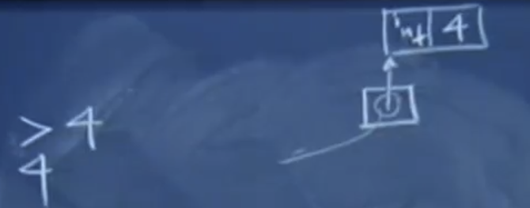
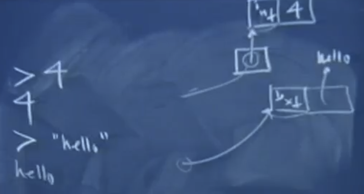
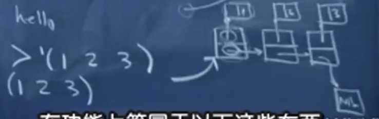

## Memory Issue in `Scheme`

### `int`

|`int`| `4`|
|-|---|

|a `pointer` pointing at `int`|
|-|

When you type in a `4` the scheme interpreter is prepared to **build a variable in memory** that stores that `4`.

What basically happens is it recognizes as it parses it that it’s a pure integer `int`. It actually returns **a `pointer` pointing at `int`**. So it returns a pointer to the data structure that is self-typed and self-identified as an integer and it levies some type of print operation against this thing **as part of the read, evaluate, print result loop (REPL)**. 

So the reason this prints out a `4` is because the thing that is returned by evaluation is expressed as this `pointer` and so it goes to this thing and says, oh, it’s a `4`, so that’s what it’s gonna print out. I’m gonna print it out according to what this data type is `int`. 

### `string`

|`hello`|
|-|

|`text`|a `pointer` pointing at `hello`|
|-|---|

|a `pointer` pointing at `text`|
|-|

When you type in `hello` it returns a pointer to something that’s tagged as `text` or a `string`. Rather the actual details are up to the interpreter, but as long as they return this to the read, develop, print loop and print knows how to deal with pointers to these types of cells that are self-type identifying it knows how to interpret the rest of this entire thing. 

 
 

### `list`

|`int`1|1|
|-|---|

|`int`2|2|
|-|---|

|`int`3 |3|
|-|---|

|a `pointer` pointing at `cons`1|
|-|

|`cons`1: a node of a `list`|`car`: a `pointer` pointing at `int`1|`cdr`: a pointer pointing at a `cons`2|
|-|---|---|

|`cons`2: a node of a `list`|`car`: a `pointer` pointing at `int`2|`cdr`: a pointer pointing at a `cons`3|
|-|---|---|

|`cons`3: a node of a `list`|`car`: a `pointer` pointing at `int`3|`cdr`: a pointer pointing at a `ML`|
|-|---|---|

|`ML`|
|-|

That means that the thing is returned is part of the **read, develop, print loop** has to be the address of the `leading nodule list` has to know it’s a `list`, so it knows how to print itself out.

Thing is that’s interesting is that when `Scheme` digests this `list` `'(1, 2, 3)` it knows how to programmatically – like it’s **reading a data file** where you’ve happened to express your sequence of numbers using `Scheme` like syntax and that behind the scenes every time it hits an `open paren (` it knows it’s gonna be building a `list` for you behind the scenes.

 

`'(1 2 3)` ==  `(cons 1 (cons 2 (cons 3 '())))`

`cons` as a `Scheme` symbol is attached with code. It’s native to the interpreter that knows how to basically `malloc` or `operator new`. 

And after it does that it has to figure out what to put in `node` and what to put in `car` and `cdr`. 